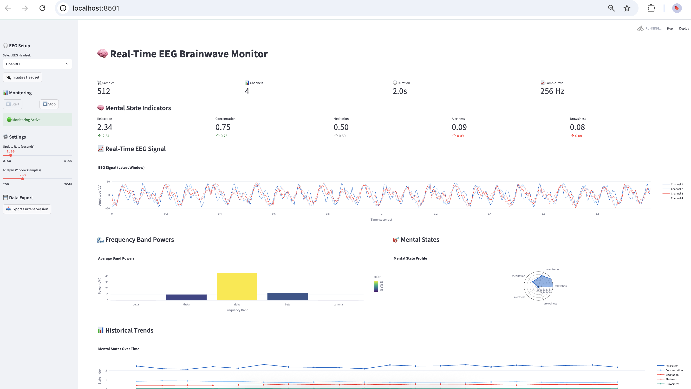

# EEG Brainwave Analysis System



A comprehensive Python-based system for collecting, analyzing, and visualizing EEG (electroencephalography) brainwave data from various headsets. This project provides real-time brain-computer interface (BCI) capabilities with practical applications.

## 🧠 Features

### Core Functionality
- **Multi-headset support**: Muse, OpenBCI, NeuroSky, Emotiv, and simulation mode
- **Real-time data collection** with configurable sampling rates
- **Advanced signal processing**: filtering, artifact removal, frequency analysis
- **Mental state detection**: relaxation, concentration, meditation, alertness, drowsiness
- **Interactive dashboard** with live visualizations
- **BCI applications**: meditation feedback, focus training, stress monitoring

### Supported EEG Headsets

| Headset | Price Range | Channels | Best For |
|---------|-------------|----------|-----------|
| NeuroSky MindWave | $100-200 | 1 | Simple BCI, demos |
| Muse 2/S | $200-300 | 4-5 | Meditation, basic research |
| Emotiv Insight/EPOC | $300-800 | 5-14 | Emotion detection, research |
| OpenBCI Cyton | $500-1000 | 8-16 | Research, full EEG mapping |

## 🎬 Demo Video

Watch the EEG Brainwave Analysis System in action:

https://github.com/user-attachments/assets/newwave.mov

*This video demonstrates real-time EEG data collection, analysis, and visualization using the brainwave analysis system.*

## 🚀 Quick Start

### 1. Installation

```bash
# Clone or download the project
cd brainwave

# Install dependencies
pip install -r requirements.txt
```

### 2. Test the System

```bash
# Run comprehensive system test
python test_eeg_system.py
```

### 3. Setup Your Headset

```bash
# Interactive headset setup guide
python headset_setup.py
```

### 4. Launch Dashboard

```bash
# Start real-time dashboard
streamlit run dashboard.py
```

### 5. Try BCI Applications

```bash
# Demo brain-computer interface apps
python bci_applications.py
```

## 📁 Project Structure

```
brainwave/
├── requirements.txt          # Python dependencies
├── eeg_collector.py         # EEG data collection from headsets
├── brainwave_analyzer.py    # Signal processing and analysis
├── dashboard.py             # Real-time Streamlit dashboard
├── test_eeg_system.py       # System testing and validation
├── headset_setup.py         # Headset configuration guide
├── bci_applications.py      # Brain-computer interface apps
└── README.md               # This file
```

## 🎧 Headset Setup

### Muse 2/S Headset
```bash
# Install muselsl
pip install muselsl

# Start streaming
muselsl stream

# Test connection
muselsl view
```

### OpenBCI Cyton
```bash
# Install OpenBCI Python API
pip install pyopenbci

# Connect via USB dongle and run
python -c "from pyopenbci import OpenBCICyton; board = OpenBCICyton()"
```

### NeuroSky MindWave
```bash
# Pair via Bluetooth and find port
ls /dev/cu.* | grep -i mindwave

# Use in collector
collector = EEGDataCollector(headset_type='neurosky')
```

### Simulation Mode
Perfect for testing without hardware:
```python
collector = EEGDataCollector(headset_type='simulation')
```

## 📊 Usage Examples

### Basic EEG Collection
```python
from eeg_collector import EEGDataCollector
from brainwave_analyzer import BrainwaveAnalyzer

# Initialize
collector = EEGDataCollector(headset_type='muse')
analyzer = BrainwaveAnalyzer()

# Collect data
collector.start_collection()
data, timestamps = collector.get_latest_data(512)

# Analyze
mental_states = analyzer.detect_mental_state(data)
band_powers = analyzer.extract_band_power(data)

print(f"Relaxation: {mental_states['relaxation']:.2f}")
print(f"Alpha power: {np.mean(band_powers['alpha']):.2f} µV²")
```

### Real-time BCI Application
```python
from bci_applications import BCIController, BCIApplications

# Setup BCI
bci = BCIController(headset_type='simulation')
apps = BCIApplications(bci)

# Start monitoring
bci.start_bci()

# Custom application
def my_app(state, confidence, old_state):
    if state == 'concentration' and confidence > 0.8:
        print("🎯 High focus detected!")

bci.register_application('my_app', my_app)
```

## 🧠 Mental State Detection

The system detects five primary mental states:

- **Relaxation**: High alpha waves, low beta activity
- **Concentration**: High beta waves, low theta activity  
- **Meditation**: High theta waves, low beta activity
- **Alertness**: High beta and gamma activity
- **Drowsiness**: High delta and theta waves

## 🌊 Frequency Band Analysis

| Band | Frequency | Associated With |
|------|-----------|----------------|
| Delta | 0.5-4 Hz | Deep sleep, unconscious |
| Theta | 4-8 Hz | Meditation, creativity |
| Alpha | 8-13 Hz | Relaxation, calm focus |
| Beta | 13-30 Hz | Active thinking, concentration |
| Gamma | 30-100 Hz | High-level cognition |

## 🎯 BCI Applications

### Built-in Applications
1. **Meditation Feedback**: Provides audio cues during meditation
2. **Focus Trainer**: Tracks concentration levels and distractions
3. **Stress Monitor**: Alerts when stress levels are high
4. **Music Controller**: Changes music based on mental state
5. **Light Controller**: Adjusts smart lighting automatically

### Custom Applications
Create your own BCI apps by registering callback functions:
```python
def game_controller(state, confidence, old_state):
    if state == 'concentration':
        increase_game_difficulty()
    elif state == 'drowsiness':
        suggest_break()

bci.register_application('game_control', game_controller)
```

## 📈 Dashboard Features

The Streamlit dashboard provides:
- Real-time EEG signal visualization
- Live frequency band analysis
- Mental state indicators
- Historical trend tracking
- Session data export
- Multi-channel support

Access at `http://localhost:8501` after running `streamlit run dashboard.py`

## 🔬 Technical Details

### Signal Processing
- Butterworth bandpass filtering (0.5-50 Hz)
- Artifact removal using statistical thresholding
- Welch's method for power spectral density
- Feature extraction: band powers, asymmetry indices, spectral edge

### Machine Learning
- Random Forest classifier for pattern recognition
- Feature standardization and selection
- Real-time prediction with confidence scores
- Training on custom labeled datasets

### Performance
- Real-time processing at 256 Hz sampling rate
- Low-latency analysis (<100ms)
- Efficient memory management
- Multi-threaded data collection

## 🛠️ Development

### Testing
```bash
# Run system tests
python test_eeg_system.py

# Test specific components
python -c "from eeg_collector import EEGDataCollector; c = EEGDataCollector('simulation'); c.start_collection()"
```

### Adding New Headsets
1. Implement connection logic in `EEGDataCollector._setup_[headset]()`
2. Add parsing in `_collect_data_thread()`
3. Update `headset_setup.py` with configuration guide
4. Test with real hardware

### Custom Analysis
Extend `BrainwaveAnalyzer` with new features:
```python
def extract_custom_features(self, data):
    # Add your feature extraction logic
    features = {}
    features['custom_metric'] = calculate_custom_metric(data)
    return features
```

## 🚨 Troubleshooting

### Common Issues

**No data streaming:**
- Check headset battery and connection
- Verify correct driver installation
- Run headset-specific test commands

**Poor signal quality:**
- Ensure proper electrode contact
- Clean electrodes and skin
- Minimize movement and electrical interference

**LSL connection errors:**
- Restart streaming software
- Check firewall settings
- Try different LSL stream names

### Debug Mode
Enable detailed logging:
```python
import logging
logging.basicConfig(level=logging.DEBUG)
```

## 📚 Research Applications

This system supports various research applications:
- Cognitive load assessment
- Meditation and mindfulness studies
- Attention and focus research
- Brain-computer interface development
- Neurofeedback therapy
- Sleep stage analysis

## 🤝 Contributing

Contributions welcome! Areas of interest:
- Additional headset support
- New analysis algorithms
- BCI application templates
- Performance optimizations
- Documentation improvements

## ⚖️ License

This project is for educational and research purposes. Commercial use may require additional licenses for certain headset SDKs.

## 🔗 Resources

### Documentation
- [MNE Python](https://mne.tools/) - EEG analysis library
- [Lab Streaming Layer](https://labstreaminglayer.readthedocs.io/) - Real-time data streaming
- [OpenBCI Documentation](https://docs.openbci.com/) - Hardware guides

### Datasets
- [EEG Motor Movement/Imagery Dataset](https://physionet.org/content/eegmmidb/1.0.0/)
- [CHB-MIT Scalp EEG Database](https://physionet.org/content/chbmit/1.0.0/)

### Hardware Vendors
- [Muse Headband](https://choosemuse.com/)
- [OpenBCI](https://openbci.com/)
- [NeuroSky](http://neurosky.com/)
- [Emotiv](https://www.emotiv.com/)

---

**🧠 Start exploring your brainwaves today!** 

Begin with simulation mode to familiarize yourself with the system, then connect your EEG headset for real-time brain analysis.
# BrainwaveScanner
